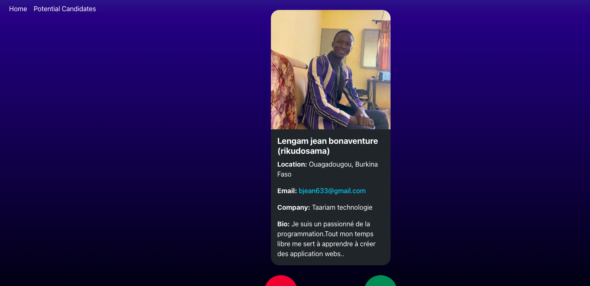
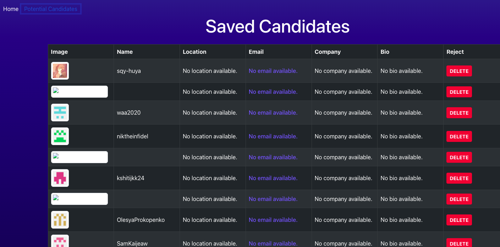

# module-13-challenge
# Github Candidate Search

## Description
The Candidate Search app is a front-end project made with TypeScript and React that connects to the GitHub API. It helps employers find candidates, save their profiles to a list, and manage the saved list. The app is easy to deploy using Render and gives clear messages when no candidates are found, making it simple to use.

## Table of Contents
- [Installation Instructions](#install-instructions)
- [User Story](#user-story)
- [Usage](#usage)
- [Technologies Used](#technologies-used)
- [Deployed Application](#deployed-application)
- [Screenshots](#screenshots)

## Installation Instructions

To set up the project locally, follow these steps:

1. Clone the repository: 
git clone https://github.com/mglo196/module-13-challenge

2. Navigate into the project folder:
cd to Challenge-13-Candidate-Search/Develop

3. Install dependencies: 
Make sure you have Node.js and npm installed. If not, you can install them from here.
Then, run the following command: npm install

4. Create a GitHub Personal Access Token: To access the GitHub API at a higher rate limit, generate a GitHub Personal Access Token.

5. Set up the token in your environment: Store your GitHub token in an environment variable named VITE_GITHUB_TOKEN.

6. Start the development server: Run the following command to start the app: npm run dev

7. View the application: Open http://localhost:5174 in your browser to view the application.

## User Story
> AS AN employer  
> I WANT a candidate search application  
> SO THAT I can hire the best candidates

## Usage
**The Candidate Search application allows employers to browse candidates fetched from the GitHub API and save the best candidates to a list. Here’s how it works**:

**View Candidate Information**: Upon loading the page, a candidate’s profile will be displayed, including their avatar, name, username, location, email, company, and bio.

**Save Candidates**: When a candidate looks promising, click the "+" button to save them to the list of potential candidates.

**Skip Candidates**: If a candidate is not of interest, click the "-" button to move to the next candidate without saving.

**View Saved Candidates**: On the "Potential Candidates" page, you can see a list of previously saved candidates with their details.

**Persisting Data**: The list of saved candidates is persisted across page reloads, ensuring that the list remains intact when the application is restarted.

## Technologies Used
**React**: JavaScript library for building user interfaces.

**TypeScript**: Superset of JavaScript that adds static typing.

**GitHub API**: RESTful API to access GitHub user data.

**Render**: Cloud platform used for deploying the application.

**Bootstrap**: Front-end framework for responsive, mobile-first projects.

## Deployed Application

https://module-13-challenge-2.onrender.com/ 

## Screenshots

